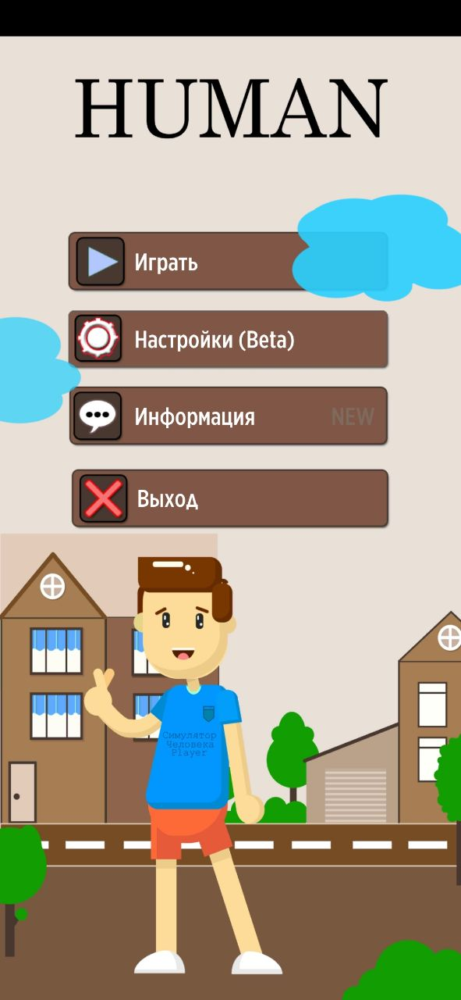
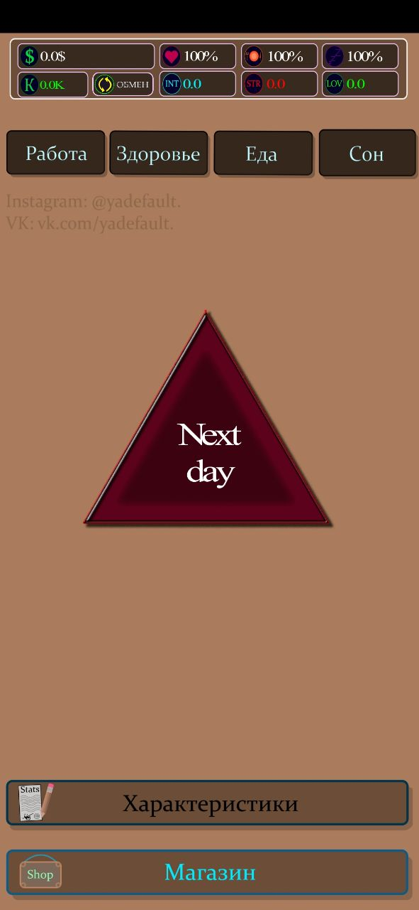
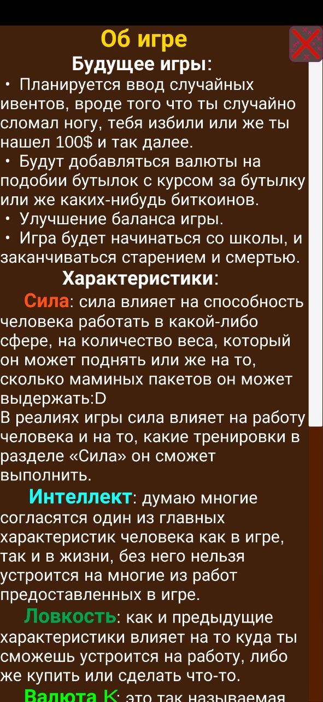
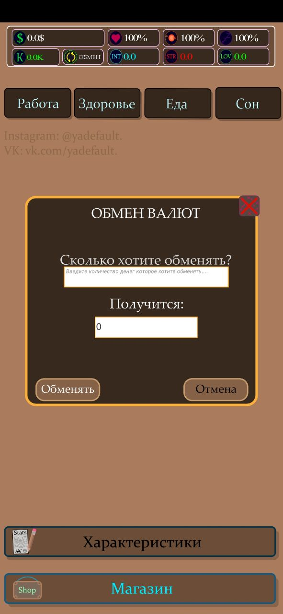
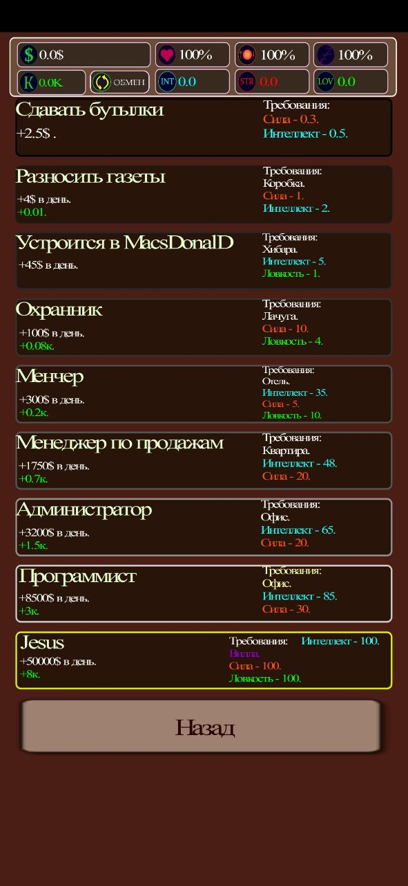
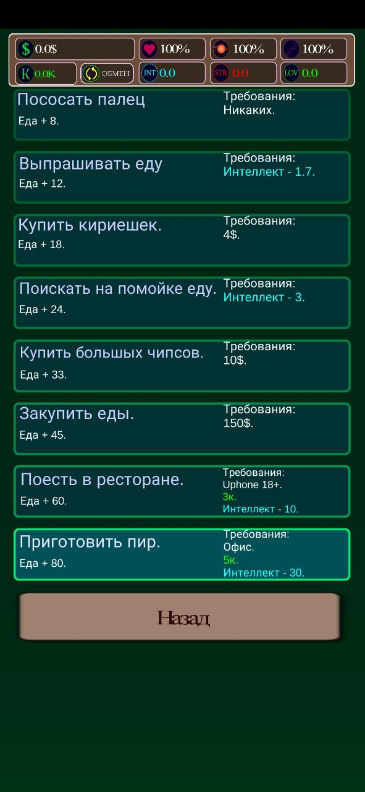
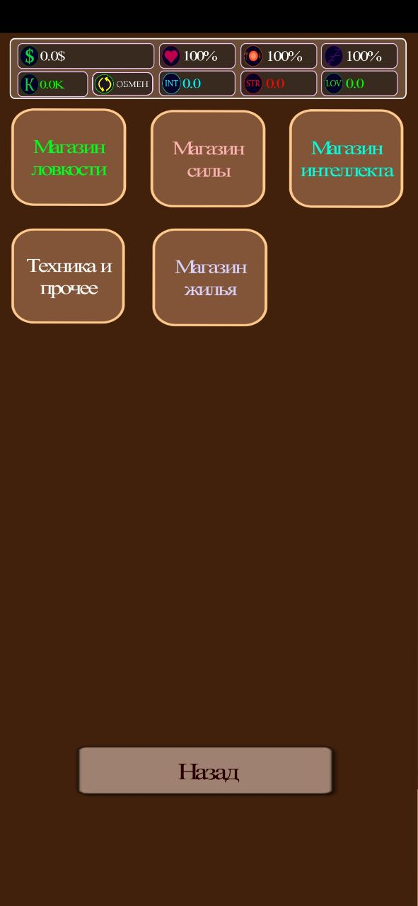
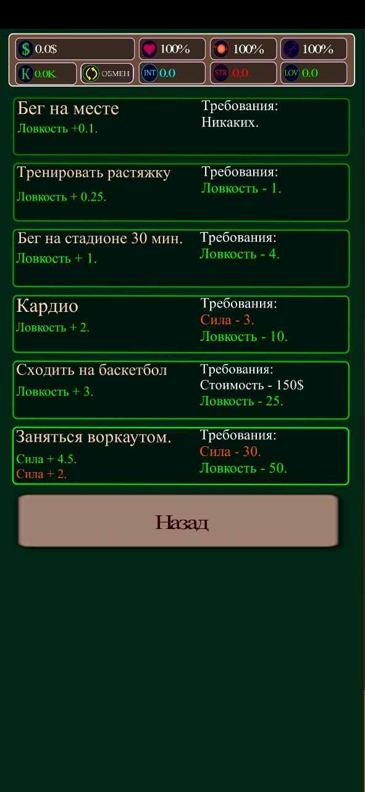
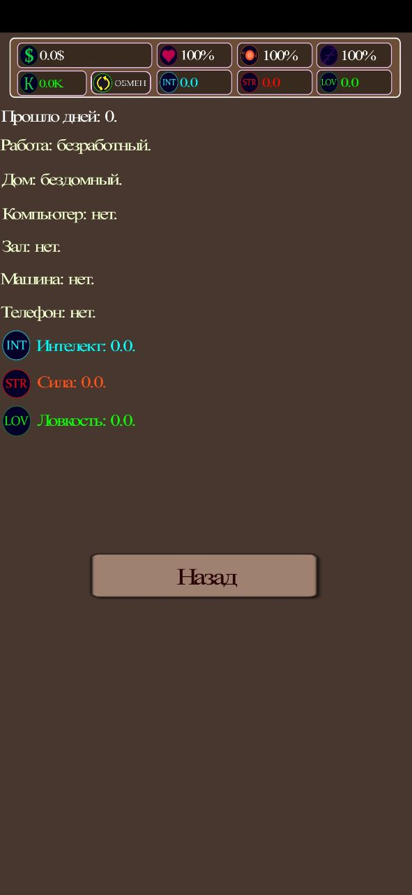

# Game Human Sumulator

I wrote this game at the beginning of my path as a programmer. Unfortunately, only the apk file ws saved. The game was written in Unity, all the sprites and graphics were drawn by me in Illustrator, the whole game was written without knowledge of OOP and many other basic things.

# Gameplay

